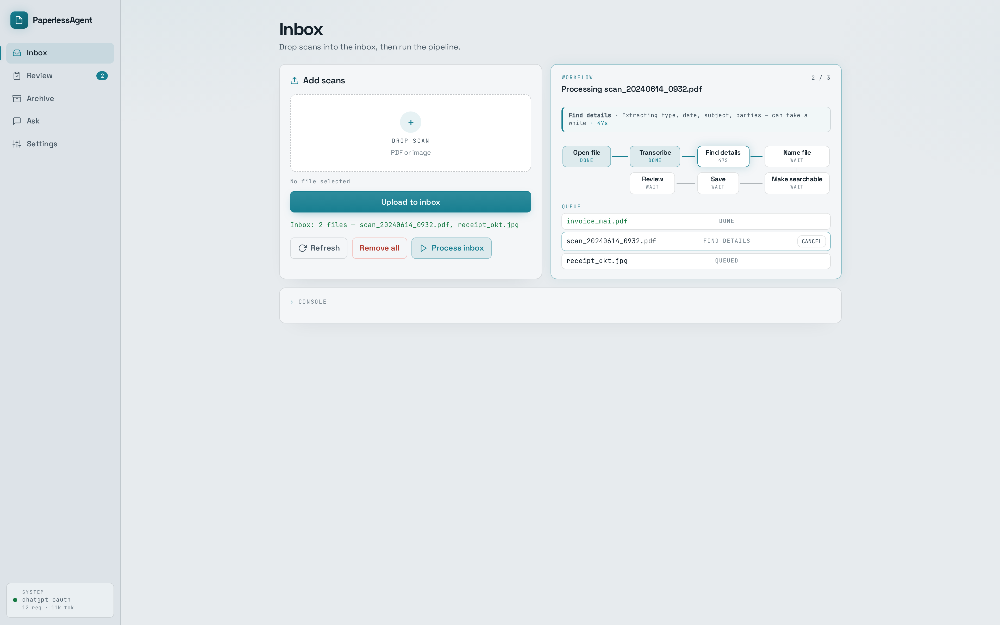
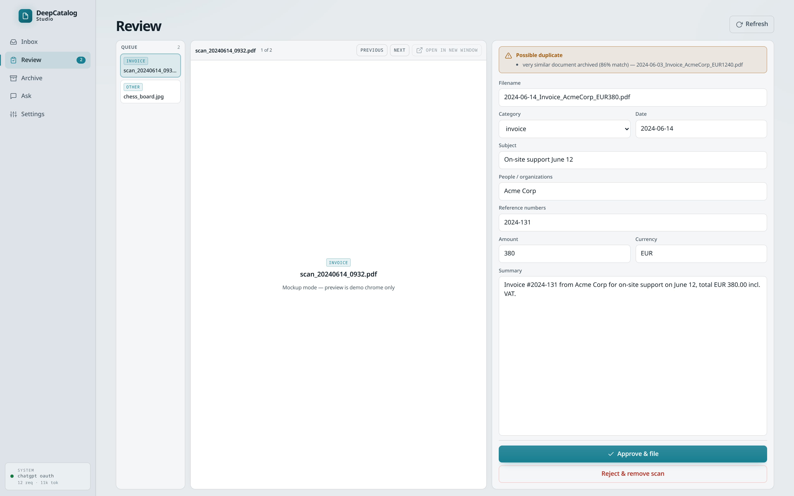
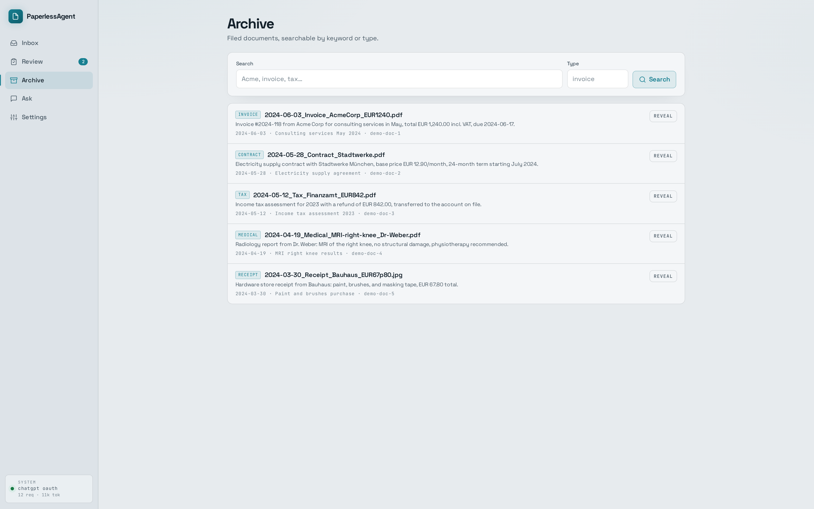
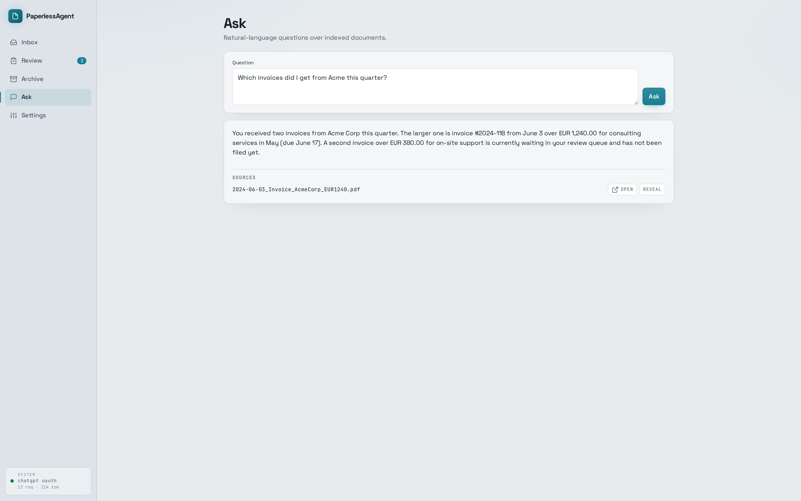
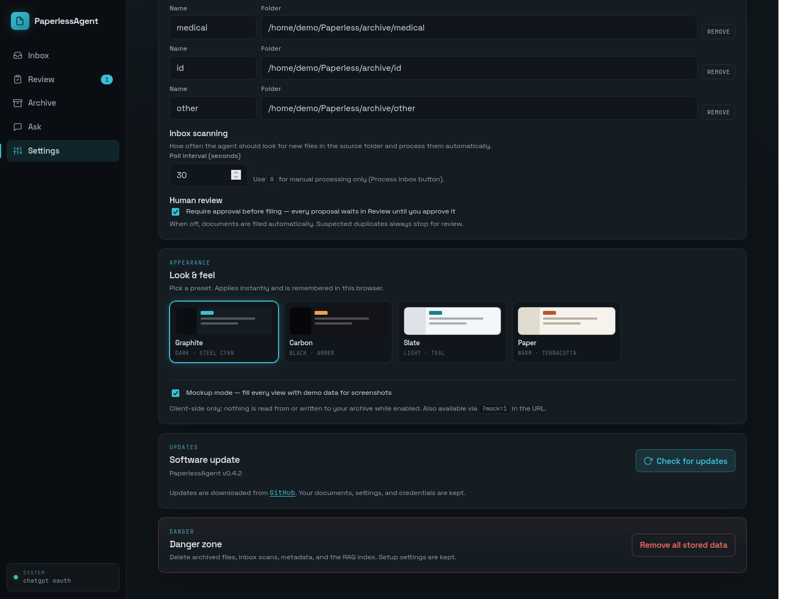

# PaperlessAgent

Local-first document agent: drop scanned PDFs and photos into an inbox, and it recovers the text with AI vision OCR, extracts structured metadata, proposes a meaningful filename, and files everything into your folder structure — with you in the loop before anything is written. Metadata lands in SQLite, content is indexed for RAG so you can ask questions about your archive in natural language.

Built with [Google ADK](https://adk.dev/) (Python) + FastAPI. Works with **OpenAI (ChatGPT OAuth or API key)**, **Gemini**, or **Ollama (fully local)**. Everything runs and stays on your machine.



## Features

- **Ingest pipeline**: Open file → Transcribe → Find details → Name file → Review → Save → Make searchable, with a live workflow strip (Server-Sent Events) and hover descriptions on each step
- **Per-file cancel & retry**: stop a stuck or slow file mid-pipeline; retry failed or cancelled items from the inbox queue (readable error toasts for API failures)
- **Human-in-the-loop review**: every proposed filing waits in a review queue where you can correct filename, category, date, parties, reference IDs, amount (financial docs only), and summary before approving — nothing touches your filesystem until you say so (optional; can be switched to fully automatic)
- **Smart metadata extraction**: category-aware fields — `subject`, `parties`, and `reference_ids` for all document types; amount/currency only for invoices, receipts, bank/tax/utility/insurance documents. Missing `doc_type` defaults to `other`; common aliases (`document_type`, `category`) are accepted
- **Duplicate detection**: SHA-256 file checksums, normalized content hashes, and text-similarity matching flag re-scans and near-duplicates before they are filed
- **Ask your archive**: RAG-backed natural-language questions with source citations
- **Local storage**: configurable inbox and per-category archive folders, `data/paperless.db` (SQLite), `data/chroma/` (vectors)
- **Inbox polling**: automatic processing of new scans on a configurable interval
- **Local Ollama tooling**: start the daemon, pull models, show CPU/GPU usage for loaded models, unload or restart Ollama from Settings
- **Boot autostart (Linux)**: optional systemd user service so the web UI comes up after login or reboot
- **Web app**: single-page UI with four theme presets (dark/light), toast notifications, and a mockup mode for clean screenshots
- **Self-update**: check and install new releases from GitHub directly from Settings

## Screenshots

All screenshots use the built-in mockup mode (Settings → Look & feel), which fills the UI with demo data.

| Review queue | Archive (Slate theme) |
| --- | --- |
|  |  |

| Ask the archive | Settings |
| --- | --- |
|  |  |

## Install

Cloning the repo alone is not enough — Python dependencies must be installed into a local virtualenv (`.venv`). Without that step you will see `No such file or directory: .venv/bin/activate` and/or `ModuleNotFoundError: No module named 'fastapi'` when starting the app (often because a system-wide `uvicorn` is used instead of the venv one).

### One-line install (recommended)

Creates `~/paperlessagent` (or updates it), builds `.venv`, installs dependencies, and writes a starter `.env`:

```bash
curl -fsSL https://raw.githubusercontent.com/dpastoetter/paperlessagent/main/scripts/install.sh | bash
```

Then start it:

```bash
cd ~/paperlessagent
source .venv/bin/activate
uvicorn app.main:app --port 8080
```

Confirm the prompt shows `(.venv)` (or that `which uvicorn` points at `…/paperlessagent/.venv/bin/uvicorn`) before starting. Open [http://localhost:8080](http://localhost:8080). Sign in under **Settings → AI provider**, point the inbox at your scan folder, and process a document.

Optional:

```bash
# Install somewhere else
PAPERLESS_DIR=~/apps/paperlessagent curl -fsSL \
  https://raw.githubusercontent.com/dpastoetter/paperlessagent/main/scripts/install.sh | bash

# Re-run anytime to pull the latest code and refresh dependencies
# (safe to run again if you already cloned but never created .venv)
curl -fsSL https://raw.githubusercontent.com/dpastoetter/paperlessagent/main/scripts/install.sh | bash
```

### Desktop window (optional)

From a venv install, after `pip install -r requirements-desktop.txt` (needs WebKitGTK on Linux):

```bash
python -m paperless_agent.desktop
```

The desktop wrapper respects `PAPERLESS_HOST`, `PAPERLESS_PORT`, and `PAPERLESS_LOG_LEVEL`.

### Uninstall

Removes the install directory (app code, `.venv`, local `data/`, and `.env`):

```bash
rm -rf "${PAPERLESS_DIR:-$HOME/paperlessagent}"
```

This does not delete ChatGPT/OpenAI credentials in `~/.codex/auth.json`, archive/inbox folders you pointed outside the install directory, or a systemd user unit if you enabled autostart — disable autostart in Settings first, or run `systemctl --user disable paperlessagent.service`.

Needs **Python 3.10+** (with the `venv` module), **git**, and **Poppler** (`pdftoppm`) for PDF OCR:

```bash
# Fedora / RHEL
sudo dnf install poppler-utils
# Debian / Ubuntu — python3-venv is required for .venv creation
sudo apt install python3-venv poppler-utils
# macOS
brew install poppler
```

### Manual setup

Use this if you cloned with `git` and skipped the installer:

```bash
git clone https://github.com/dpastoetter/paperlessagent.git
cd paperlessagent
python3 -m venv .venv
source .venv/bin/activate
pip install -U pip
pip install -r requirements.txt
cp .env.example .env   # skip if .env already exists
```

If you already have a clone but no `.venv`, run the `python3 -m venv` / `pip install` steps above (or re-run the one-line installer) before starting the server.

## AI providers

Cloud providers are locked until you approve the **cloud processing disclaimer** in **Settings → AI provider** (document page images and text leave this machine). Local Ollama does not require that acknowledgement.

### OpenAI / ChatGPT

In the web UI, open **Settings → AI provider → Cloud (ChatGPT)** and choose one:

1. **Sign in with ChatGPT** — Codex-compatible OAuth (PKCE). Tokens are stored in `~/.codex/auth.json` and model calls use the Codex Responses backend against your ChatGPT subscription.
2. **Save API key** — stores a Platform `sk-…` key in the same auth file (usage-based billing).

You can also set `OPENAI_API_KEY` in `.env`. Auth resolution prefers an API key when present, otherwise ChatGPT OAuth tokens.

```bash
PAPERLESS_LLM_PROVIDER=openai
PAPERLESS_MODEL=gpt-5.6-luna
# Optional override for ChatGPT OAuth (defaults to gpt-5.6-luna):
# PAPERLESS_CODEX_MODEL=gpt-5.6-terra
PAPERLESS_EMBEDDING_MODEL=text-embedding-3-small
```

ChatGPT OAuth only supports Codex models (e.g. `gpt-5.6-luna` / `terra` / `sol`). Platform IDs like `gpt-4.1` are rejected — the app auto-falls back to `gpt-5.6-luna` in that case. ChatGPT OAuth uses a local embedding fallback for RAG; for higher-quality embeddings, save an API key.

**Find details (metadata extract)** uses the Codex Responses streaming API. The pipeline asks for JSON only and parses fenced or partially wrapped replies; empty model output is reported distinctly from invalid JSON. Platform API-key mode can additionally request JSON object mode on chat completions.

### Gemini (alternative)

```bash
PAPERLESS_LLM_PROVIDER=gemini
GOOGLE_API_KEY=...
PAPERLESS_MODEL=gemini-flash-latest
PAPERLESS_EMBEDDING_MODEL=text-embedding-004
```

### Ollama (fully local)

Run everything on your own hardware — no cloud account, no API key. The agent, AI vision OCR, and RAG embeddings all go through your local Ollama server.

1. Install [Ollama](https://ollama.com/download) and make sure it is running (`ollama serve`), or use **Start Ollama** in Settings when the CLI is installed but the daemon is down.
2. Open the app → **Settings → AI provider → Local Ollama**.
3. Click **Pull required models** (defaults: multimodal `gemma3` + `nomic-embed-text`).

That writes the provider into `.env` and switches the running app — no manual restart for the provider change. You can still configure it by hand:

```bash
ollama pull gemma3            # or llama3.2-vision, qwen2.5vl, minicpm-v
ollama pull nomic-embed-text  # embeddings for RAG
```

```bash
PAPERLESS_LLM_PROVIDER=ollama
PAPERLESS_MODEL=gemma3
PAPERLESS_EMBEDDING_MODEL=nomic-embed-text
# OLLAMA_BASE_URL=http://localhost:11434   (default)
```

**User-local install (no sudo):** on Linux you can install the Ollama binary under `~/.local/bin` and libraries under `~/.local/lib/ollama`. If you use a user-local build, ensure `LD_LIBRARY_PATH` includes `~/.local/lib/ollama` when starting `ollama serve` (PaperlessAgent’s systemd autostart unit sets this automatically when that directory exists).

While Ollama is the active provider, PaperlessAgent checks that the daemon is reachable and listening (and that required models are present) before chat, OCR, or embedding work. Health reports `degraded` when the local instance is offline or models are missing. Settings shows:

- **CPU / GPU / CPU + GPU** — inferred from Ollama’s `/api/ps` (`size_vram` on loaded models)
- **Start Ollama** — launch the daemon (systemd unit when available, otherwise `ollama serve`)
- **Unload model** — free RAM/VRAM after a long OCR run
- **Restart Ollama** — recover from a stuck daemon (blocked while a file is processing unless you cancel first)

If `PAPERLESS_LLM_PROVIDER` is unset, the app auto-selects OpenAI when a key/Codex login is available, else Gemini when `GOOGLE_API_KEY` is set, else a **running local Ollama** when one responds on `OLLAMA_BASE_URL`. Set `PAPERLESS_SKIP_OLLAMA_PROBE=1` to skip the localhost probe during auto-detect (useful in tests or air-gapped installs).

## Run the web app

Always activate the project venv first so you use its `uvicorn` and packages, not the system ones:

```bash
cd ~/paperlessagent   # or your install directory
source .venv/bin/activate
uvicorn app.main:app --host 127.0.0.1 --port 8080
```

| Symptom | Fix |
| --- | --- |
| `.venv/bin/activate: No such file or directory` | Re-run the installer. On Debian/Ubuntu also install `python3-venv`, then remove a broken leftover with `rm -rf ~/paperlessagent/.venv` and install again |
| `ModuleNotFoundError: No module named 'fastapi'` | Same — dependencies were never installed into `.venv`, or the venv was not activated |
| Port already in use | Stop the other instance: `pkill -f "uvicorn app.main:app"`, or pick another port with `--port 8081` and `PAPERLESS_PORT=8081` |
| Ollama OCR times out on CPU | Raise `PAPERLESS_OLLAMA_OCR_PAGE_TIMEOUT` (default 900s) or lower `PAPERLESS_OLLAMA_OCR_MAX_IMAGE_PX` (default 1024); see [OCR tuning](#ocr-and-long-documents) |
| Find details fails with “invalid JSON” | Usually empty/malformed model output — retry the file; with ChatGPT OAuth confirm a Codex model is selected and you are signed in |

Uvicorn binds to `127.0.0.1` by default — keep it that way. The API has no login; mutating routes are protected against cross-site form posts by a custom header the UI always sends, but binding with `--host 0.0.0.0` would still expose your documents and settings to anyone on the network.

Open [http://localhost:8080](http://localhost:8080).

### Autostart at boot (Linux + systemd)

**Settings → Autostart → Start PaperlessAgent when the system boots** installs a user systemd unit at `~/.config/systemd/user/paperlessagent.service`, runs `loginctl enable-linger` so the service can start without an interactive login, and starts the unit if port 8080 is free.

The unit reads your install’s `.env`, sets `DATA_DIR`, and uses the venv `uvicorn` from the project root. Customize bind address/port with `PAPERLESS_HOST` and `PAPERLESS_PORT` in `.env` before enabling autostart.

Manual control:

```bash
systemctl --user status paperlessagent.service
systemctl --user restart paperlessagent.service
journalctl --user -u paperlessagent.service -f
```

Autostart requires Linux with `systemctl --user`. It is hidden on other platforms.

## Typical flow

1. Upload a scan in **Inbox** (or copy files into your source folder)
2. Click **Process inbox** — or let the poller pick it up automatically
3. Watch the live workflow strip; use **Cancel** on the active file if needed, then **Retry** after it stops
4. Check **Review**: correct the proposal if needed, then **Approve & file** (duplicates are flagged with a match score)
5. Find the filed document in **Archive**, or ask questions in **Ask**

Filing rules (source folder, category → folder mapping, poll interval, review requirement) live in **Settings → Filing & scanning** and are stored in `data/settings.json`.

### Processing controls

| Action | Where | Behavior |
| --- | --- | --- |
| **Cancel** | Inbox queue (active file) | Cooperative cancel — in-flight LLM/Ollama HTTP calls are aborted; button shows “Cancelling…” until the job ends |
| **Retry** | Inbox queue (error/cancelled) | Re-queues one file; if that file is still active, cancel is requested first |
| **Unload model** | Settings → Local Ollama | Drops loaded Ollama weights to free memory |
| **Restart Ollama** | Settings → Local Ollama | Restarts the daemon; blocked while processing unless the active file is cancelled |

Progress updates stream over `GET /api/process/events` (SSE). The workflow UI mounts once and patches in place to avoid flicker during rapid updates. Hover a pipeline step for a short description of what that stage does (and live detail while it is running).

### Metadata & review fields

During **Extract**, the LLM returns JSON with:

| Field | Description |
| --- | --- |
| `doc_type` | One of your configured categories (built-in types include invoice, receipt, bank, tax, utility, insurance, letter, contract, certificate, employment, medical, id, education, travel, other). Defaults to `other` when omitted; aliases like `document_type` / `category` are normalized |
| `doc_date` | Document date when present |
| `subject` | Short topic or title |
| `parties` | Sender, recipient, issuer, etc. |
| `reference_ids` | Policy numbers, invoice numbers, case refs (list) |
| `amount` / `currency` | Only kept for financial categories |
| `summary` | Short plain-language summary |

The review form shows amount/currency only when the selected category is financial. Reference IDs are editable as a comma-separated list.

## OCR and long documents

Text recovery on ingest always uses **AI vision OCR** on rendered page images; a PDF text layer, when present, serves as a hint and fallback.

By default, **all PDF pages** are transcribed (one vision call per page, up to 128 pages). Per-page OCR is slower but avoids truncated output on multi-page scans. Page images are downscaled before vision OCR. For **local Ollama**, images use a tighter default max edge (`1024px`) and JPEG quality ~80 so dense scans stay tractable on CPU; cloud providers keep the larger `1536px` default.

Tune via `.env` (see `.env.example` for the full list):

| Variable | Default | Purpose |
| --- | --- | --- |
| `PAPERLESS_OCR_MAX_PAGES` | `0` (all) | Cap pages per document; `0` = all up to safety max |
| `PAPERLESS_OCR_SAFETY_MAX_PAGES` | `128` | Hard ceiling on page count |
| `PAPERLESS_OCR_DPI` | `200` | PDF render resolution |
| `PAPERLESS_OCR_PAGE_TIMEOUT` | `180` | Seconds per page (cloud providers) |
| `PAPERLESS_OLLAMA_OCR_PAGE_TIMEOUT` | `900` | Seconds per page (local Ollama — CPU can be slow) |
| `PAPERLESS_OCR_MAX_IMAGE_PX` | `1536` | Max width/height before vision OCR (cloud) |
| `PAPERLESS_OLLAMA_OCR_MAX_IMAGE_PX` | `1024` | Max width/height for local Ollama OCR |
| `PAPERLESS_OLLAMA_OCR_NUM_CTX` | `4096` | Ollama context for OCR calls |
| `PAPERLESS_OLLAMA_OCR_NUM_PREDICT` | `4096` | Max tokens per OCR page (Ollama) |
| `PAPERLESS_OLLAMA_VISION_NUM_CTX` | `8192` | Ollama context for other vision calls |
| `PAPERLESS_OLLAMA_VISION_NUM_PREDICT` | `8192` | Max tokens for other vision calls |
| `PAPERLESS_EXTRACT_MAX_CHARS` | `48000` | OCR text sampled for metadata extraction (head + tail when longer) |

LLM timeouts (chat, vision, Ollama) and cancel join behavior:

| Variable | Default | Purpose |
| --- | --- | --- |
| `PAPERLESS_LLM_TIMEOUT` | `120` | Text completion timeout (seconds) |
| `PAPERLESS_LLM_VISION_TIMEOUT` | `300` | Cloud vision timeout |
| `PAPERLESS_OLLAMA_TIMEOUT` | `300` | Ollama chat/vision timeout |
| `PAPERLESS_CANCEL_JOIN_TIMEOUT` | `3` | Max wait when joining a cancelled async LLM call |

If you switch embedding providers (Gemini / OpenAI / Ollama), re-index documents — vector spaces are not compatible.

## Updates

**Settings → Software update** checks the GitHub releases of this repository and can download and install the latest version in place. Your documents, database, settings, and credentials (`data/`, `.env`) are never touched by an update.

Installs are **fail-closed on integrity checks**: the updater only applies a release that includes a `.tar.gz` asset with a SHA-256 digest (GitHub asset `digest` and/or a `SHA256SUMS` file). Tag-only or checksum-less releases are shown but refused at install time. Update checks retry on transient network failures.

Override the release source with `PAPERLESS_UPDATE_REPO=owner/repo` if you fork the project.

Pushing a version tag (`v*`) runs GitHub Actions, which builds the tarball and `SHA256SUMS`, then publishes/updates the GitHub Release. The packager archives the **exact tagged commit** (not a dirty working tree), verifies the file list against `git ls-tree`, and embeds a `.release-commit` manifest (tag, SHA, file count) inside the archive.

**Release checklist:** land every change on `main` first, bump `version` in `pyproject.toml`, commit, then create the tag on that commit (`git tag v0.2.0 && git push origin v0.2.0`). Tagging an older commit is how earlier releases missed later work.

Local dry-run:

```bash
git checkout v0.2.0
./scripts/make-release-assets.sh v0.2.0
# or before the tag exists:
./scripts/make-release-assets.sh v0.2.0 HEAD
# dist/ contains paperlessagent-0.2.0.tar.gz and SHA256SUMS
```

## Mockup mode

**Settings → Look & feel → Mockup mode** fills every view with demo data — useful for screenshots and demos without exposing personal documents. It is client-side only: while enabled, no real data is read or written, and all mutating actions are blocked. Also available ad hoc via URL parameters: `http://localhost:8080/?mock=1&theme=slate#/archive`.

## Development

### Tests & pre-commit gate

```bash
pytest -q                 # full suite, offline (embeddings and LLM calls are stubbed)
./scripts/precommit.sh    # syntax checks + secret guard + tests
```

Install the pre-commit hook once per clone so the gate runs on every commit:

```bash
ln -sf ../../scripts/precommit.sh .git/hooks/pre-commit
```

The gate refuses commits containing `.env` files, databases, `data/` content, or anything that looks like an API key.

### ADK agents (debug)

```bash
adk web --port 8000
# or
adk run paperless_agent
adk run query_agent
```

### Inbox watcher (CLI alternative to the built-in poller)

```bash
python scripts/watch_inbox.py --process-existing
```

## Project layout

```
paperless_agent/       # ingest pipeline, review queue, dedup, updater, auth/llm helpers
  ingest.py            #   OCR → extract → name → review gate → file + index
  ocr.py               #   per-page vision OCR, PDF render, image prep
  llm.py               #   OpenAI / Codex OAuth / Gemini / Ollama + cooperative cancel
  progress.py          #   SSE progress + pipeline step labels/descriptions
  job_control.py       #   per-file cancel events for ingest
  review.py            #   human-in-the-loop queue (approve / reject)
  dedup.py             #   checksum + content-hash + similarity duplicate detection
  ollama_setup.py      #   Ollama probe, model pull, CPU/GPU summary, provider switch
  system_service.py    #   systemd user unit for boot autostart
  updater.py           #   self-update from GitHub releases
query_agent/           # RAG Q&A agent
app/                   # FastAPI backend + single-page web UI (app/static/)
scripts/               # install.sh, make-release-assets.sh, watch_inbox.py, precommit.sh
tests/                 # offline test suite
docs/screenshots/      # README screenshots (generated with mockup mode)
data/                  # created at runtime (gitignored)
```

## Configuration reference

All optional variables are documented in `.env.example`. Common entries:

```bash
DATA_DIR=./data
PAPERLESS_HOST=127.0.0.1
PAPERLESS_PORT=8080
PAPERLESS_LLM_PROVIDER=ollama   # gemini | openai | ollama
PAPERLESS_MODEL=gemma3
PAPERLESS_EMBEDDING_MODEL=nomic-embed-text
OLLAMA_BASE_URL=http://localhost:11434
```

Runtime settings (inbox path, categories, poll interval, review requirement) are edited in the web UI and stored in `data/settings.json`, not in `.env`.

## License

[Apache License 2.0](LICENSE) — Copyright 2026 dpastoetter
